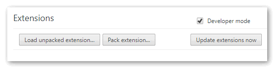

# VSTS Status Monitor

Interested in getting notified when Microsoft [Visual Studio Team Services (VSTS)](https://visualstudio.com/vsts) goes down for maintenance or when it comes back up? Well, now you can, using this simple Google Chrome extension.

## Download ##

## Build ##

- Clone this repository.
- Download and open in [Visual Studio Code](https://code.visualstudio.com/).
- `Ctrl + Shift + B` to build the extension.
- Build will generate the `dist` directory with all the comiled JS files.
- Now open Google Chrome and go to `More tools` | `Extensions`.
- Check `Developer mode` and then click `Load unpacked extension`
     
- Browse to generated `dist` folder and you should see the extension loaded in Chrome.